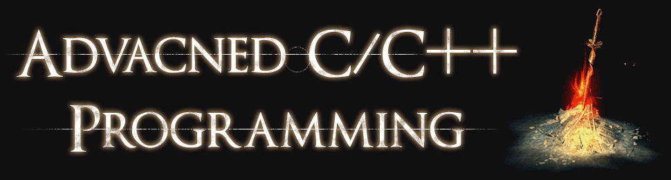

|    Date    |  Topic / Exercise  | Darksouls Boss |
| ---------- | ------------------ | -------------- |
| 2017-10-06 | Welcome            |                |
| 2017-10-20 | [Infrastructure]   |                |
| 2017-10-27 | [First Challenge]  | [Iudex Gundyr] |
| 2017-11-03 | [Back to Basics]   | [Dragon Rider] |
| 2017-11-10 | [Brave New Worlds] | [The Pursuer]  |
| 2017-11-17 |                    |                |
| 2017-11-24 |                    |                |
| 2017-12-01 |                    |                |
| 2017-12-15 |                    |                |
| 2018-01-12 |                    |                |
| 2018-01-19 |                    |                |
| 2018-01-26 |                    |                |
| 2018-02-02 |                    |                |

[Infrastructure]: ex01
[First Challenge]: ex02
[Back to Basics]: ex03
[Brave New Worlds]: ex04

[Iudex Gundyr]: https://www.youtube.com/watch?v=J8J7ZB4vJkg
[Dragon Rider]: https://www.youtube.com/watch?v=dk4qf7rP8k0
[The Pursuer]: https://www.youtube.com/watch?v=v7L8jcTNeG8

The lab will take place in RR15.

# Grading

Grading will be done through weekly exercise sheets.
At the beginning of each lab your team is asked to mark which exercises you have solved by yourself *and* prepared for presentation.
Marking an exercises therefore not only means that you have a solution, but also that you are able to explain it to the class and answer questions related to the exercise and its context.
To pass this PS you have to:

- mark at least 75% of all exercises (excluding bonus exercises); and
- receive at least two positive grades for a presentation.

Note that exercises can build on-top of each other -- even across exercise sheets.
Solutions will *not* be provided.
Organise yourself with your fellow students if you are missing crucial material.

Each of the folders `ex01`, `ex02`, ... represents on exercise sheet.
Exercise tasks and material are located within these folders.

You do not have to submit your solution unless stated explicitly by the exercise.

## Presentation

How exactly you present your solution is up to you.
Just be prepared to fit your explanation in a 20 minute slot.
While a computer is provided by the ZID you are advised to bring your own laptop along.
Please check if your system is compatible with the installed projector before the lab starts.
VGA and HDMI are available for connecting your laptop with the projector.

> In ZID we do not trust.

## Absence

You do not have to inform me about your absence.
If a team is only partially present, they can still mark exercises.
But if the team has to present an exercise, the people missing will not receive a grade.
Please not that I will *not* take absence statistics into account when selecting teams for presentations.
Therefore, if you do not attend this lab often you may not be able to get the number of grades required to pass.

## Note about C++17

Most compilers already implement C++ 17 features, you are free to use them, but remember that they are still considered experimental.
Use `-std=c++1z` to access these features.

# Contacting Me

If you have questions or want to know more about a certain topic I am always glad to help.
You can find me in room 2W05 of the ICT building.

You can also contact me by email, just be sure to send it from your university account.
Please keep your email informal and include the course number in the subject.

:email: [send email](mailto:alexander.hirsch@uibk.ac.at?subject=703807%20-%20)

# Essential References

- [C++ 14 Standard (Draft)](http://www.open-std.org/jtc1/sc22/wg21/docs/papers/2014/n4296.pdf)
- [Google C++ Style Guide](https://google.github.io/styleguide/cppguide.html)
- [cppreference.com](http://en.cppreference.com)

# Useful References / Tools

- [Awesome Modern C++](https://github.com/rigtorp/awesome-modern-cpp)
- [Boost](http://www.boost.org)
- [C++ 17 Standard (Draft)](http://www.open-std.org/jtc1/sc22/wg21/docs/papers/2017/n4687.pdf)
- [Clang Format](http://clang.llvm.org/docs/ClangFormat.html)
- [Clang Sanitizers](https://clang.llvm.org/docs/UsersManual.html#controlling-code-generation)
- [Clang Tidy](http://clang.llvm.org/extra/clang-tidy/)
- [CMake](https://cmake.org)
- [Curated List of Awesome C/C++ Stuff](https://github.com/fffaraz/awesome-cpp)
- [Doxygen](http://www.stack.nl/~dimitri/doxygen)
- [Google Test](https://github.com/google/googletest)
- [Modern C++ Features](https://github.com/AnthonyCalandra/modern-cpp-features)
- [Online C++ Demangler](https://demangler.com)
- [STL Containers](http://en.cppreference.com/w/cpp/container)
