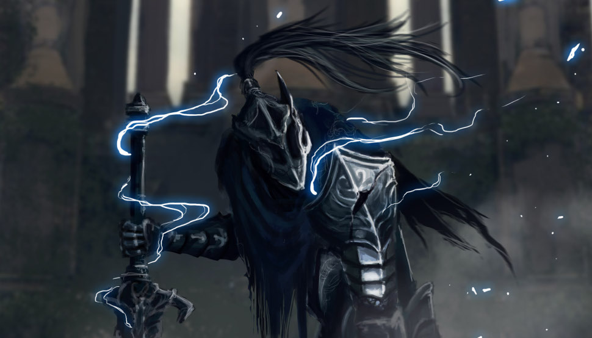

# Exercise Sheet 6 -- Stepping it up

*due on 24 November 2017*

## Task 1

Make yourself familiar with [SDL2_ttf] and think about a good data-structure for implementing menus.
You are encouraged (but not required) to write a specific for this feature, like done previously.
This data-structure should allow for easy navigation, modification, and displaying of menus.

[SDL2_ttf]: https://www.libsdl.org/projects/SDL_ttf/

Your task is to implement a basic *title menu* with the following entries:

- **New Game**, starts a new game
- **Load Game**, *see task 2*
- **Settings**, change some settings regarding already implemented game mechanics (optional)
- **Exit**, quits the game

Furthermore, implement a *pause menu* which can be accessed while playing the game.
It should provide the following entries:

- **Resume**, closes the *pause menu* and resumes playing
- **Save Game**, *see task 2*
- **Load Game**, *reuse implementation for the title menu*
- **Go to Title**, go back to the title menu

## Task2

As already teased by task 1, you are now to implement a loading and saving mechanism.
For saving you have to *serialise* your whole game state into a file.
The game state should than later on be restored from that file upon loading.

Put your save files in a folder named `saves` besides the `resources` folder.

Congratulations, you now have a more sophisticated save mechanism than most modern AAA video games.

## Task 3

Make yourself familiar with [SDL2_mixer] and implement a few sound effects and background music.
Similar to 2D sprites, you can find lots of sound effects and background music on the internet released under a suitable license.

[SDL2_mixer]: https://www.libsdl.org/projects/SDL_mixer/

Or you could just [generate some tunes](https://www.ampermusic.com/) yourself.

In-case you have already implemented sound effects and background music.
Explore ways to improve the audio experience for your players.
For example:

- cross-fading between different background music tracks (entering and exiting battle)
- using multiple *layers* (ie slight variations of the same track) and change between them
- ...

In other words, explore more sophisticated ways than just playing a given sound file.
[SDL2_mixer] does only provide a very limited set of effects and transitions, but it should get you started.

## Task 4 (Bonus)

Inside the `submissions` folder you can find the submissions of all teams for exercise sheet 4.
Take a peek at them and implement one game mechanic (not yet integrated into your game) based on the provided specification.

**Note:** As this repository is publicly available I removed student names from the files, unless I missed some there should be only team numbers.
If anyone wants to have their name be present, send me an email either as individual student or as team -- I'll add it to the corresponding files.

- - -

> One of Gwyn's Four Knights, Sir Artorias is a holy warrior with an unbendable will of steel and unmatched skill with a greatsword.
> His personal symbol is a wolf, as depicted in his ring, and he later gains a wolf companion named Sif.

> Artorias was present during the fall of New Londo.
> The home of the Darkwraiths, the Abyss, can only be traversed by the creatures of the Dark.
> To be able to destroy it from the inside, Artorias made a covenant with the creatures of the Abyss, symbolized by a ring.
> But in doing so, his greatsword became cursed.
> In recognition of his actions in the New Londo crisis, he gains the moniker "The Abysswalker" and awarded one of Anor Londo's treasures, a blessed pendant that allowed him to repel the Dark of the Abyss.
