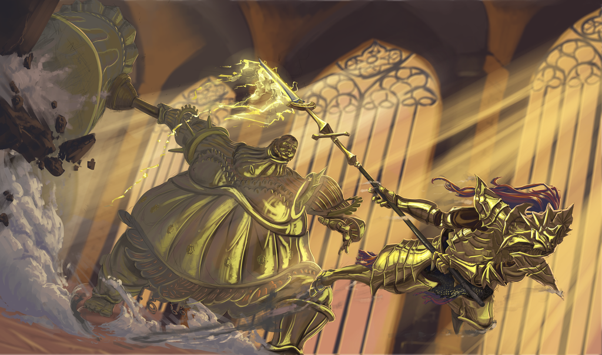

# Exercise Sheet 8 -- This and That

*due on 15 December 2017*

Finish up the refactoring process of your dungeon crawler.
You should now have a code-base which provides all the features / mechanics requested up until now.
(Your own game mechanics, the map, menus, sound, save & load, ...)

## Task 1

Put together a short document which states what, and especially why, changes were made to your code base during the refactoring process.

## Task 2

Think about the current state of your game.
Apart from content (eg additional maps, more enemy variety), what tasks are left to do so you would consider your game *finished*.

Are there any additional game mechanics / features which need to be implemented.
Does your game have a *golden thread* for the player -- is the journey / end goal obvious.

Do you think the player will have a good time playing?
If you are not sure, describe what changes need to be made.

Put together a rough outline for future tasks including a short description.
Estimate the amount of time needed to fulfil each task.
This is not about setting a hard deadline, but creating a form of roadmap to finish this project.

## Task 3

Implement some form of random map generation for your dungeon crawler.
You can either generate the whole map directly from code, or provide a set of pieces which can be mixed and matched together.

This should *not* replace the ability of loading hand-crafted maps from a file.
Add an entry to your settings menu where you can select which method is used.
Later on we may use both methods together, for now a simple switch suffices.

Additionally, the player should be able to provide a seed for the random number generator used for map generation.
This should make it easier to reproduce scenarios.

## Task 4

Think about what parts of your game require the biggest amount of computation.
Figure out your game's limits by cranking up various parameters like map size, number of entities, etc.
How far can you go before the framerate dips below 60?

Determine the impact of each parameter you modify.

## Task 5

Take the `.cpp` files from the lecture regarding *storage modifiers* & *linkage*.
Compile them into object files and view their content using `nm`.
What do you notice?

Then, take the parts of these files, which are also valid in C, put them into a `.c` file and compile this to an object file using a C compiler.
Again view the content using `nm` and check for differences with the object file created from C++ code.

- - -

## Submission

Stick to the same criteria as for exercise sheet 4.
Use the following naming convention and the link below.

- `team_XX_refactoring.txt`
- `team_XX_roadmap.txt`

:email: [send email](mailto:alexander.hirsch@uibk.ac.at?subject=703807%20-%20Dungeon%20Crawler%202)

- - -

> Smough relished his title as executioner, so much so that he ground the bones of his victims into his feed.
> He desired to be a part of Gwyn's Knights, but was rejected due to his apparent gleeful love of his work as an executioner as well as his cannibalistic behavior.
>
> Smough was one of the few living beings left who was present in Anor Londo, fighting alongside Dragon Slayer Ornstein.

> Ornstein was one of Lord Gwyn's most trusted knights, and the first knight chosen by Lord Gwyn's Firstborn.
> Believed to be the captain of the Four Knights of Gwyn, he was granted a special soul and ring by the Lord of Sunlight.
>
> His golden armor was made to resemble a lion and was imbued with the power of lightning.
> It is said that his lugged spear could slice a boulder in two.[4] After the gods fled Anor Londo, Ornstein guarded its cathedral alongside Executioner Smough.
