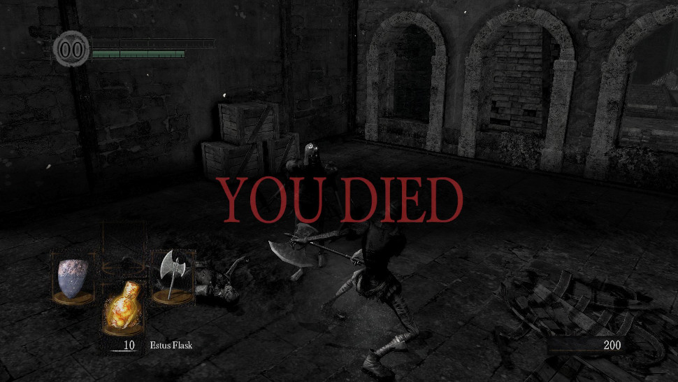
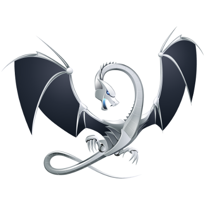
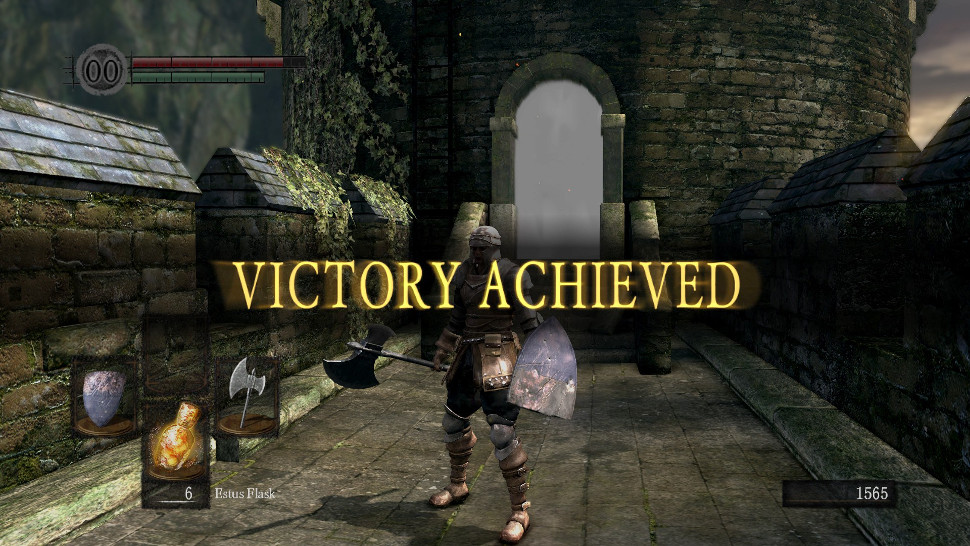
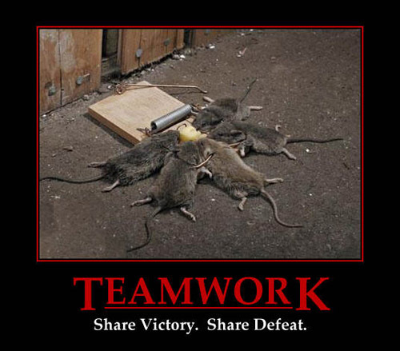
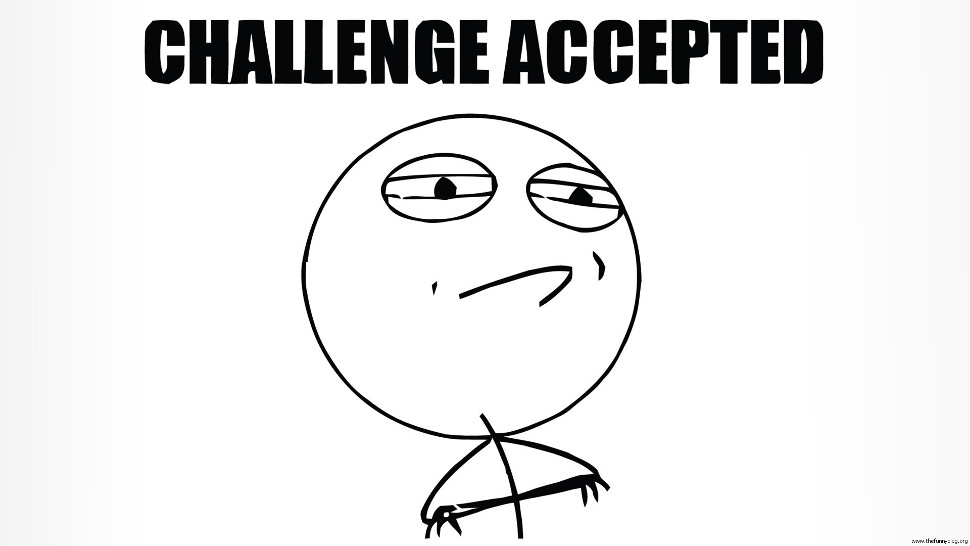

% Advanced C/C++ Programming
% Alex Hirsch
% 6 October 2017

## About Me

Alex Hirsch

- member of the DPS research group
- working on the Insieme compiler:
    - Haskell-based Analysis Framework (MSc Thesis)
    - general C/C++ tasks
    - visualisation / tools
    - build system stuff   (ノ°Д°）ノ︵ ┻━┻
- doing stuff on <https://github.com/W4RH4WK>
- now, enough with that...

# Welcome to C++

- - -

or better

- - -

Welcome to

- - -

## C++ / Dark Souls

is...

- notorious for being *hard*
- looks easy at first glance
- easy to get wrong / fail completely
- lots of deaths (your program / you)

> "If your program segfaults, consider yourself lucky."

- - -

, but over time you will...

- learn useful techniques
- learn how to prevent errors & pitfalls
- better understand its internals
- be able to overcome challenges

- - -

Sounds tough. Why'd I do that?

- succeeding feels extremely rewarding
- learned techniques can be applied elsewhere
- its not for everyone, hence you are special `<3`

C++ is used where the real shit happens:

- high performance computing (HPC)
- compiler research
- game engines
- ...

- - -

- - -

- - -

- - -

- - -

# This Proseminar

## Content

- supporting the lecture via mandatory exercises
- discussing paradigms
- learning coding techniques to prevent future errors

## Modus Operandi

- - -

- - -

- *weekly* exercise sheets
- teams consisting of 3 people
- tick solved exercises at the start of the proseminar\
  (as team)
- I'll pick a team at random to present a (ticked) exercise
- I'll ask each member of the team some questions
- each member will receive an individual grade
- be prepared to answer questions from your fellow students

## Requirements

In order to pass, you must at least:

- tick 75% of all (excluding bonus) exercises; and
- receive two positive grades for a presentation.

# Course Material

## Available on GitHub

- I'll send you a mail with this link:\
  <https://git.io/vd0P8>
- you should read the README

# First Two Exercise Sheets

## 1. Infrastructure

## 2. Basic Version Control System

- - -

# Any Questions?

- - -

## Then

1. build your team now
2. read through the course material
    - <https://git.io/vd0P8>
    - README
    - first two exercise sheets
4. come to me, so I can note down the members
5. I'll stay here for questions
